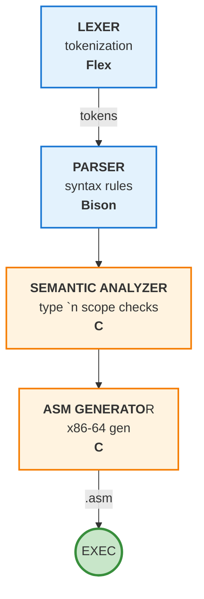

<div align="center">
  Rather than rewriting the entire codebase to implement proper per-object lifecycle management, I opted for a pragmatic solution - a tracked allocator that collects all dynamic allocations and frees them at program exit. Is this the proper way? No. Ideally, each structure would manage its own lifecycle. Does the OS free memory on exit anyway? Yes. So why bother? Clean habits, Valgrind silence. Also, this is a 3+ year old university project meant as an ability and basic compiler understanding showcase, not a prod grade thing - i just thought i cant leave it w/o anything so here it is.
  <br><br>
  <i>If you're a recruiter reading this - I'd rather spend time building something new than endlessly polishing old university code. But I don't like to leave broken things behind and felt like it should be addressed. I'm aware of other flaws as well, but I have decided against a full rewrite. My focus is on applying my current knowledge to new challenges, rather than maintaining projects that have already served their educational purpose.</i>
</div>
<br><br>

## How to run

### Install
```bash
sudo apt-get install flex bison nasm
```


### Running compiler on txt file
```bash
Make
./parser < fileName.txt
```

## Syntax
### Declarations
Creates integer.
```bash
int variableName = 10;
int variableName;
```
Creates floating point num.
```bash
double variableName = 2.2;
double variableName;
```
Creates string.
```bash
string variableName = "abcd";
```
Arrays can be decalred with same types as variables.
```bash
int intArray[10];
double dbArray[5];
string strArray[12];
```
It is possible to initialize array along with its contains.
```bash
int intArray[10]{1,2,3}; (where rest will be 0.)
double dbArray[5]{1.2,2.2,3.3};
string strArray[12]{"aaa","bbb","ccc"};
```
### Assigning values
Assigning diffrent types is permitted, however assigning int variable to a double will transform integer into floating point num and add .0000 part.
```bash
int intVar = 10;
int anotherIntVar = 20;
double doubleVar = 4.4;
int intArray[10];

intVar = anotherIntVar;
intVar = 30;
intVar = .m(40*20/10+20-40*2);
doubleVar = intVar;
intArray[5] = intVar;
(...)
```
### Prinintg to the console
to print to the console you should use .p prefix.
```bash
.p variableName;
.p "whatever you want to write";
.p "writting" + varName + "even more written text";
.p intArray[4];
```
### If statements
If statements are limited and else-if statement can't be created.
If statements can be nested.
Each variable created in if or for statement can be accessed only from that statement.
```bash
if(a == b){
  if(a >= b){
    if(a < c){
     }
  }

  if(a==b){

  }
}
```
### For loops
```bash
for(int i = 0; i < 10; i++){
    //stuff
}
```

# Flow


# Assembly file
All of the declared variables are known and saved in ram inside .section data int the assembly file, asm is divided by flows, starting from initial _Start, each time the highstatement appears the new flow is created. After the flows, loops and higherstatements there are pre-written functions which are necessary for proper operations
